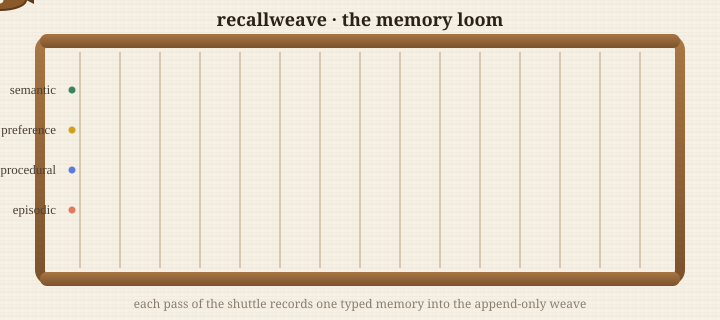

<div align="center">

# RecallWeave

[](https://github.com/michaeldelali/RecallWeave/actions/workflows/ci.yml)  
### a local-first agent memory lifecycle engine

*Threads of memory, laid one pass at a time, into a cloth you can inspect,
mend, and fold — never a black box, never the cloud.*



</div>

---

Every long-running agent accumulates a tangle of things it "knows": facts it was
told, preferences it inferred, procedures it was taught, events it witnessed.
Most memory tooling reaches straight for a vector database and calls the problem
solved. But a vector index answers exactly one question — *"what is similar to
this?"* — and stays silent on all the questions a memory actually has to answer
over its lifetime:

- Where did this belief come from, and how sure am I?
- This contradicts what I knew yesterday — which one wins?
- This was only ever true for an afternoon; when do I let it go?
- Has anyone tampered with what I remember?
- Can I hand my whole memory to another tool without leaking the machinery?

**recallweave is the loom, not the thread.** It is the *lifecycle* layer: it
gives every memory an identity, a provenance, a confidence, a time-to-live, and a
place in an append-only, tamper-evident weave. It dedupes, detects conflicts,
forgets on schedule, compacts, verifies its own integrity, and exports a portable
*memory-pack* that a companion viewer turns into a woven tapestry you can read at
a glance.

It is written in **Rust with the standard library only** — no `serde`, no
`clap`, no crypto crates — so the entire format, from the JSON codec to the hash
chain, is a few hundred lines you can audit in an afternoon. The companion
**tapestry viewer** is **TypeScript** and consumes only the exported pack.

> **What it is not.** recallweave does **no semantic search**. Matching is
> lexical. It is a lifecycle engine you run *beside* a vector store, not a
> replacement for one. The [honest limitations](#-honest-limitations) section
> means every word of that.

---

## Table of contents

- [The weaving metaphor](#-the-weaving-metaphor)
- [Quick start](#-quick-start)
- [The threads: memory kinds](#-the-threads-memory-kinds)
- [The loom: the append-only weave](#-the-loom-the-append-only-weave)
- [Tending the cloth: the lifecycle](#-tending-the-cloth-the-lifecycle)
- [Forgetting, on purpose](#-forgetting-on-purpose)
- [The tapestry viewer](#-the-tapestry-viewer)
- [Command reference](#-command-reference)
- [Worked example: an agent's week](#-worked-example-an-agents-week)
- [Design principles](#-design-principles)
- [Honest limitations](#-honest-limitations)
- [Building, testing, layout](#-building-testing-and-project-layout)
- [License](#-license)

---

## 🪡 The weaving metaphor

A loom holds a set of taut vertical threads — the **warp** — under tension. The
weaver passes a **shuttle** back and forth, trailing a horizontal thread — the
**weft** — over and under the warp. Row by row, the passes accumulate into cloth.
Once a row is beaten into place it is *fixed*; you do not go back and re-thread
it. To change the finished cloth you either weave *more* on top, or you cut a
thread and let it fray.

recallweave takes that literally:

| loom                        | recallweave                                              |
|-----------------------------|----------------------------------------------------------|
| a pass of the shuttle       | appending one event to the log                           |
| a weft thread               | a single memory                                          |
| the colour of a thread      | the memory's *kind*                                      |
| thread thickness / length   | *confidence*                                             |
| a finished, beaten-in row   | an immutable log record                                  |
| cutting a thread            | a **tombstone**                                          |
| re-weaving over an old row  | a **supersession**                                       |
| a thread that frays with time | a **TTL** expiry                                        |
| folding the cloth to store it | **compaction**                                         |
| checking the weave for slips | integrity **verification**                              |
| rolling the cloth off the loom to show someone | exporting a **memory-pack**             |

The two animated panels in this README (`docs/assets/memory-loom.svg` and
`docs/assets/forgetting-weave.svg`) are hand-authored SVGs that show the shuttle
weaving typed threads, and threads fading, being cut, and re-woven during
forgetting and compaction. They are local files — no external assets, no
tracking — so they render anywhere the SVG does.

---

## 🚀 Quick start

You need a Rust toolchain (1.74+). Node 18+ is only needed for the viewer.

```bash
# build the engine
cargo build --release

# point every command at a store directory with --dir (default: .recallweave)
alias rw='./target/release/recallweave --dir mymemory'

# weave in some memories
rw add --kind semantic   --content "prod region is eu-west-1" --tags infra,region
rw add --kind preference --content "prefers concise answers"  --tags style --confidence 0.8
rw add --kind procedural --content "rotate the API token via ops runbook step 3" --tags ops
rw add --kind episodic   --content "deploy failed at 14:03"    --tags infra --ttl 86400

# read the cloth
rw list
rw query --kind preference --contains concise
rw stats

# check the weave has not been tampered with
rw verify

# roll it off the loom into a portable pack
rw export --out memory-pack.json
```

Then turn the pack into a tapestry:

```bash
cd viewer
npm install
npm run build
node dist/cli.js ../memory-pack.json --svg tapestry.svg
```

---

## 🎨 The threads: memory kinds

recallweave is *typed on purpose*. A memory's kind changes how you should treat
it, so the type is first-class rather than a free-text tag.

- **🟢 semantic** — durable facts. *"The prod region is eu-west-1."* These are the
  backbone threads; they rarely expire, and when they change you usually
  **supersede** rather than delete.
- **🟡 preference** — stated or inferred preferences. *"Prefers concise answers."*
  The liveliest, most conflict-prone threads: people change their minds. This is
  the only kind the polarity conflict detector inspects.
- **🔵 procedural** — how-to knowledge. *"Rotate the token by running step 3 of the
  ops runbook."* Recipes worth keeping verbatim.
- **🔴 episodic** — things that happened at a moment. *"Deploy failed at 14:03."*
  The threads most likely to fray: give them a **TTL** and let the loom forget
  them on schedule.

Every thread also carries the metadata that makes a memory trustworthy:
**provenance** (`source` + `detail` — *why do I believe this?*), **confidence**
in `[0,1]`, **tags**, **links** to related memories, a **fingerprint** for
dedupe, and lifecycle fields (`ttl_secs`, `supersedes`, `superseded_by`,
`tombstoned`). The full schema lives in [`docs/MEMORY.md`](docs/MEMORY.md).

---

## 🧶 The loom: the append-only weave

The store is a directory (default `.recallweave/`) holding a single
`log.jsonl` — **one JSON event per line, in the order it happened.** Three event
types are ever written:

- `assert` — a new memory (a new weft thread).
- `tombstone` — retire a memory (cut a thread), with a reason.
- `supersede` — replace one memory with another (re-weave a row).

The **current state** is not stored anywhere. It is *derived* by replaying every
event in order:

```
   log.jsonl (events)  ──replay──▶  materialized state (id → Memory)
         ▲                                   │
         │ append                            ▼
    assert / tombstone / supersede    query · verify · export · compact
```

Because state is a pure function of the log, the log is the single source of
truth and nothing is silently lost. You can always ask *"how did I come to
believe this?"* and replay to find out.

### Tamper-evidence: the integrity chain

Each record commits to the one before it. It stores `prev` — the digest of the
previous record — and `digest`, a 256-bit hash over its own canonical payload
*chained* with `prev`. The first record's `prev` is 64 zeros (GENESIS). Alter any
byte of any record and every digest downstream stops matching:

```bash
$ rw verify
integrity OK: 7 records, chain intact

# ... someone edits log.jsonl by hand ...
$ rw verify
integrity FAILED (7 records):
  - seq 3: digest mismatch (record contents were altered)
```

This is a **checksum chain, not a signature.** It catches accidental corruption
and casual tampering. It does not stop a determined attacker who rewrites the
whole file — for that, sign the exported pack out of band. (Said plainly again in
the limitations.)

---

## 🧷 Tending the cloth: the lifecycle

### Deterministic dedupe

Before fingerprinting, content is **normalized**: trimmed, internal whitespace
collapsed, lowercased. So these two are the *same* memory:

```bash
rw add --kind semantic --content "prod region is eu-west-1"
rw add --kind semantic --content "PROD region   is  eu-west-1"   # → deduped
```

If a **live** memory of the **same kind** already has that fingerprint, no new
record is written and the existing id comes back with `deduped: true`. Fully
deterministic, fully explainable — and, honestly, only lexical: a paraphrase is a
different thread.

### Supersession — re-weaving a row

When a fact changes, you do not delete the old one; you weave a new row over it:

```bash
rw supersede --old mem_9f21b35efe51 --content "prod region is us-east-1"
```

The old memory gains a `superseded_by` pointer and drops out of the live set; the
new one records what it `supersedes`. History is intact until you compact.

### Conflict detection — spotting crossed threads

`conflicts` reports (and never mutates) two kinds of clash among live memories:

1. **duplicate-content-different-kind** — the same normalized content stored as,
   say, both `semantic` and `preference`. Usually a modelling slip.
2. **preference-polarity** — two live preferences that share a subject token but
   differ on a recognised antonym (`dark`/`light`, `concise`/`verbose`, …):

```bash
$ rw conflicts
1 conflict(s):
  [preference-polarity] mem_0572… <-> mem_881f…: preferences appear to conflict on 'dark' vs 'light'
```

The shared-subject guard means *"prefers dark theme"* vs *"prefers light beer"*
does **not** trip it. This is a small, transparent heuristic — a nudge, not an
oracle.

---

## 🍂 Forgetting, on purpose


Forgetting is a feature, not a failure. Three mechanisms let the cloth shed what
it no longer needs:

- **Time-to-live.** Give a memory `--ttl <seconds>`; once `created_at + ttl` has
  passed it drops out of `list`/`query` automatically, and `rw gc` makes the
  retirement explicit by tombstoning it with reason `ttl-expired`.
- **Manual tombstones.** `rw forget <id> --reason "no longer relevant"` cuts a
  specific thread.
- **Compaction.** `rw compact` folds the cloth: it reads the live set, drops
  every tombstoned / superseded / expired record, and re-weaves the survivors
  into a fresh log from GENESIS — preserving their ids and creation times, so the
  materialized live set is byte-for-byte identical before and after, and the
  integrity chain is rebuilt cleanly.

```bash
$ rw compact
compacted 12 -> 6 records (dropped 3 tombstoned, 2 superseded, 1 expired)
$ rw verify
integrity OK: 6 records, chain intact
```

The `forgetting-weave.svg` panel animates exactly this: a TTL thread fading to
dashed as its little clock drains, a tombstoned thread being cut with a marker
dropped in the gap, and a compaction sweep tightening the remaining cloth.

---

## 🖼 The tapestry viewer

The engine and the viewer are **decoupled by design**: the viewer never reads the
log or understands the hash chain. It consumes only the portable **memory-pack**
(`format: "recallweave-pack"`), a self-describing JSON document with the live
memories, per-kind and per-tag counts, detected conflicts, and the integrity
head.

The TypeScript viewer (`viewer/`) renders two things from a pack:

- a **text report** for the terminal and CI logs, and
- a woven **SVG tapestry**: each kind is a warp band, each memory a weft thread
  (length = confidence, colour = kind, a knot = has links), retired threads
  dashed and faded, and conflicts drawn as animated crossed red threads.

```bash
cd viewer && npm install && npm run build
node dist/cli.js ../examples/memory-pack.json                     # text report
node dist/cli.js ../examples/memory-pack.json --svg tapestry.svg  # + SVG
node dist/cli.js ../examples/memory-pack.json --svg -             # SVG to stdout
```

The rendering is deterministic: the same pack always yields byte-identical SVG,
and all user content is XML-escaped (there is a test for a `<script>` payload).

---

## 📖 Command reference

Every command takes `--dir <path>` (default `.recallweave`), an optional
`--now <epoch>` to pin the clock for reproducible runs, and `--json` where a
machine-readable form makes sense.

| command                    | what it weaves                                                  |
|----------------------------|-----------------------------------------------------------------|
| `add`                      | assert a memory (`--kind --content [--confidence --ttl --tags --links --source --detail --supersedes]`) |
| `supersede`                | replace a memory (`--old --content [--kind --confidence ...]`)  |
| `list [--all]`             | list live memories (`--all` includes retired)                   |
| `query`                    | filter (`--kind --tag --contains --min-confidence --source --sort --limit [--all]`) |
| `get <id>`                 | show one memory in detail                                       |
| `forget <id> [--reason]`   | tombstone a memory                                              |
| `gc`                       | tombstone all TTL-expired memories                              |
| `conflicts`                | report conflicts among live memories                            |
| `compact`                  | rewrite the log, dropping retired records                       |
| `verify`                   | check the integrity chain (non-zero exit on failure)           |
| `export [--out file]`      | write a portable memory-pack                                    |
| `stats`                    | summarize the store                                             |
| `help`, `version`          | the usual                                                       |

Run `recallweave help` for the full flag list.

---

## 🧪 Worked example: an agent's week

The repository ships a real, runnable demo (see `examples/`). It builds a store,
records a spread of memories, changes its mind, lets an episodic note expire, and
exports a pack — every step executed by the real binary, not mocked:

```bash
# from the project root, on any OS with a shell
sh examples/demo.sh          # bash / sh
# or
pwsh examples/demo.ps1        # PowerShell
```

That produces `examples/memory-pack.json` (committed) whose tapestry is rendered
to `docs/assets/tapestry-demo.svg`. The demo store shows a superseded region
fact, two preferences in genuine polarity conflict, a procedural runbook, and an
episodic note with a one-day TTL — the exact scene both README panels illustrate.

---

## 🎯 Design principles

1. **Lifecycle over lookup.** The hard part of agent memory is not finding a
   string; it is knowing what to trust, what changed, and what to forget.
2. **The log is the truth.** State is always a pure replay of an append-only log,
   so history is inspectable and forgetting is a deliberate act.
3. **Deterministic and explainable.** Same inputs, same ids, same fingerprints,
   same SVG. Every dedupe and every conflict has a reason you can print.
4. **Auditable to the bottom.** Standard library only; the JSON codec, hash
   chain, and CLI parser are all short enough to read.
5. **Local-first.** Everything is a file on your disk. No network, no service, no
   telemetry. Portability is an explicit export, not an accident.
6. **Honest about scope.** It says loudly what it does not do.

---

## ⚠️ Honest limitations

Read this. It is the difference between using recallweave well and being
surprised by it.

- **No semantic matching, at all.** Dedupe, conflict detection, and
  `query --contains` are **purely lexical**. *"Prefers dark theme"* and *"wants a
  dark colour scheme"* are unrelated strings to this engine. No embeddings, no
  vectors, no synonyms, no paraphrase detection. If you need similarity search,
  run a vector store alongside recallweave and let each do what it is good at.
- **The conflict detector is a small heuristic.** Preference-polarity uses a
  hand-curated antonym table plus a shared-token check. It misses conflicts
  phrased outside the table and can false-positive on coincidental antonyms. It
  is a nudge, not a truth oracle.
- **The digest is a checksum, not cryptography.** `verify` catches accidental
  corruption and casual tampering. It is **not** SHA-256 and makes no
  collision/preimage-resistance claims. Anyone who can rewrite the whole file can
  recompute a valid chain; sign the exported pack out of band if you need
  authenticity.
- **Confidence is metadata, never computed.** The engine stores and filters on
  it but never updates it. There is no belief revision.
- **Single-writer, no locking.** Concurrent writers to one directory can corrupt
  the log. In-process writes are atomic (temp file + rename); across processes,
  you are on your own.
- **Time is simple.** Epoch-second arithmetic, overridable with `--now`. No
  timezones, no calendars.
- **History grows until you compact**, and compaction discards the audit trail of
  retired memories to reclaim space.

These are deliberate trade-offs for a small, auditable, local-first tool. See
[`docs/MEMORY.md`](docs/MEMORY.md) for the reasoning behind each.

---

## 🛠 Building, testing, and project layout

```bash
make build     # cargo build --release
make test      # cargo test  +  viewer tests
make demo      # run the demo and regenerate the tapestry SVG
make verify    # build, test, clippy, fmt-check, viewer build+test
make clean     # remove build artifacts
```

```
recallweave/
├── src/                    # Rust engine (stdlib only)
│   ├── json.rs             #   hand-written JSON codec
│   ├── hash.rs             #   FNV fingerprints + 256-bit digest chain
│   ├── model.rs            #   Memory, Event, LogRecord + (de)serialization
│   ├── store.rs            #   append-only log, dedupe, conflicts, compaction…
│   ├── query.rs            #   deterministic filtering
│   ├── lib.rs              #   library crate
│   └── main.rs             #   the CLI
├── tests/                  # integration + black-box CLI tests
├── viewer/                 # TypeScript tapestry viewer
│   └── src/                #   pack parser, text report, SVG renderer, tests
├── examples/               # runnable demo + committed memory-pack
├── docs/
│   ├── MEMORY.md           # the data model & lifecycle reference
│   └── assets/             # hand-authored animated SVGs
├── Cargo.toml  Makefile  LICENSE  CHANGELOG.md
└── .github/workflows/ci.yml
```

---

## Roadmap - delivered milestones

RecallWeave grows in small, finished increments. Every milestone below is
delivered, tested and documented; the open ones are queued for the next
cycle. Each shipped item maps to code, tests and a README or docs section you
can read today.

- [x] **Append-only weave + integrity chain** - every record chained, every
      store tamper-evident via `verify`. *Delivered: 2019-08-27.*
- [x] **Typed memory kinds** - fact / note / link / event with kind-aware
      validation at weave time. *Delivered: 2020-11-12.*
- [x] **Deterministic dedupe + supersession** - identical payloads collapse;
      re-weaving a row supersedes, never rewrites. *Delivered: 2021-12-03.*
- [x] **Conflict detection** - crossed threads spotted at weave time with the
      two records named. *Delivered: 2022-10-16.*
- [x] **Forgetting + compaction** - time-based and manual forgetting, then
      compaction that preserves the chain. *Delivered: 2023-09-07.*
- [x] **Portable export** - `memory-pack.json` with checksums; any store,
      any machine, byte-identical. *Delivered: 2024-11-19.*
- [x] **Tapestry viewer** - loom-woven SVG + text report from an exported
      pack. *Delivered: 2025-11-21.*
- [x] **Stable 1.0 store format** - format pinned and documented in
      `docs/MEMORY.md`. *Delivered: 2026-08-11.*
- [ ] **Remote mirrors** - push a store to object storage with the chain
      intact. *Planned: next cycle.*
- [ ] **Query DSL** - structured queries beyond the current filters.
      *Planned: next cycle.*

---

## License
MIT — see [`LICENSE`](LICENSE). Weave freely.

<div align="center">
<sub>recallweave · a loom for what your agent remembers · local-first, dependency-light, honestly scoped</sub>
</div>

<!-- draft note 464 -->
